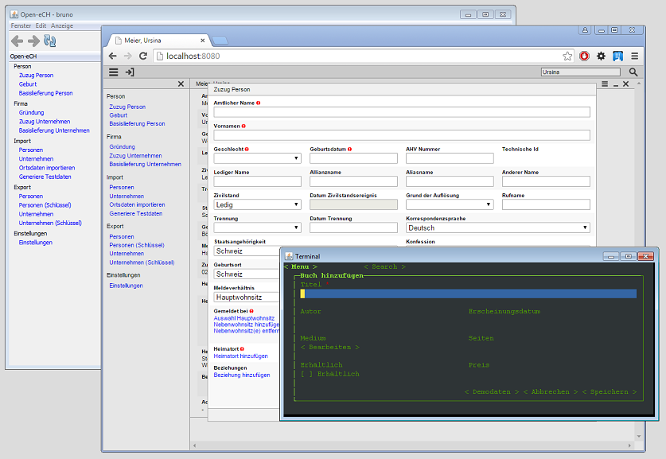

= Minimal-J

Minimal-J is an opinionated java framework for business applications. It covers the complete stack of client and server technologies. 

== Idea

Business applications tend to get complex and complicated. Minimal-J tries to prevent this by setting clear rules how an application should behave and how it should be implemented.

Minimal applications always look the same. There are no surprises for the user.

=== Features

* Independed to the used UI technology. Implementations for Html / Mobile / Swing / Terminal.
* ORM persistence layer for Maria DB or in memory DB. Transactions and Authorization supported.
* Small: The minimalj.jar is still < 1MB
* Applications run standalone or in a servlet container.

== Status

Sometimes when I look at other frameworks I think Minimal-J is quite mature.
But at the moment it is still more of a personal research project. I still
feel free to change major points. There is no 1.0 version yet.

== Documentation

link:doc/setup.adoc[Setup]

=== Topics and examples

The small examples are currently deployed on CloudFoundry as online demo. Please note that some features are still incomplete in the html frontend.

* link:example/001_EmptyApplication/doc/001.adoc[Empty Application] The smallest application link:http://minimalj-examples.cfapps.io/empty.html[(online demo)]
* link:example/002_HelloWorld/doc/002.adoc[Hello World] The hello world and the greeting application link:http://minimalj-examples.cfapps.io/greeting.html[(online demo)]
* link:example/003_Notes/doc/003.adoc[Notes] This application manages some notes link:http://minimalj-examples.cfapps.io/notes.html[(online demo)]
* link:example/004_Library/doc/004.adoc[Library] Shows some more features of the framework link:http://minimalj-examples.cfapps.io/library.html[(online demo)]
* link:example/005_Numbers/doc/005.adoc[Numbers] How integers and BigDecimals are used
link:http://minimalj-examples.cfapps.io/numbers.html[(online demo)]
* link:example/006_Persistence/doc/006.adoc[Persistence] Introduction to the O/R mapping
* link:example/007_PetClinic/doc/007.adoc[PetClinic] Cover version of the Spring PetClinic application link:http://minimalj-examples.cfapps.io/petClinic.html[(online demo)]
* link:doc/arch.adoc[Architecture] Explains the difference between client/server and frontend/backend
* link:doc/authorization.adoc[Authorization] Security concepts and configuration

=== Real application
* https://github.com/BrunoEberhard/open-ech[Open-eCH]
