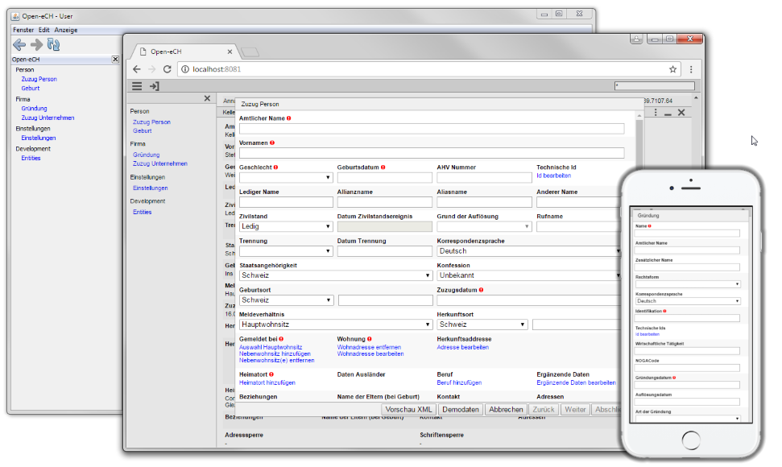

= Minimal-J

== Idea

Minimal-J is an opinionated java framework. The focus is:

* Small
* Easy to use
* Easy to specify
* No dependencies
* Works with Html / Vaadin / Swing / Terminal
* DB persistence
* be reactive

== Status

Sometimes when I look at other frameworks I think Minimal-J is quite mature.
But at the moment it is still more of a personal research project. I still
feel free to change major points. There is no 1.0 version yet.

== Documentation

link:doc/setup.adoc[Setup]

=== Examples
* link:example/001_EmptyApplication/doc/001.adoc[Empty Application]
* link:example/002_HelloWorld/doc/002.adoc[Hello World]
* link:example/003_Notes/doc/003.adoc[Notes]
* link:example/004_Library/doc/004.adoc[Library]

NOTE: The screenshots and version numbers in the documentation pages may become outdated.
