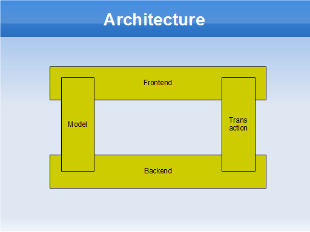
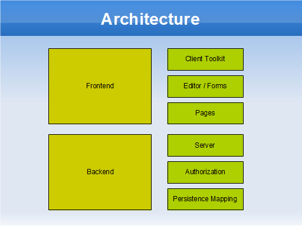

== Architecture

Minimal-J supports several different setups for an application

* Standalone: Everything is done in the same VM. The UI and the hanlding of the data. Even if this setup is kind of old fashion it can be usefull while developping the application.
* Rich client: In this setup there is a central server but the users still install software on their machines. And this is exactly the reason why newer applications are deployed third way. Not every one wants or can install software on its machine.
* Web client: Now most of the client software is also handled on a server. The user must not install special software (except for a browser that is somehow not seen as software to be installed). The application can be used from every net connected hardware.

You can switch between all these setups at every time as long as you stay in framework given by Minimal-J.

=== Frontend / Backend

Minimal-J uses these two terms in a specific way. The frontend is the part that handles user specific stuff like
build the UI. There could be run more than on instances of a frontend and even different classes of frontends
at the same time.

But there is only one backend for all the existing frontends. All frontends can send transactions to their
backend. Normally frontends only know one backend. The backend executes the transactions and gives back the
result to the frontend.

NOTE: Frontend and backend share a
common data model. There are no such things like DTO (data transfer object) or VB (visual beans).

=== Client / Server

This diagram shows where the split is between client and server in the various setups. 

In the standalone setup there is only one machine handling everything from frontend
to backend. When rich clients are used at least two (virtual) machines are involved.
The responsibilities are as expected: The client does the frontend and the server the
backend.

When using a web client most of the UI implementation is executed on a server hardware.
Only a small part is actually executed on the hardware near the user.

