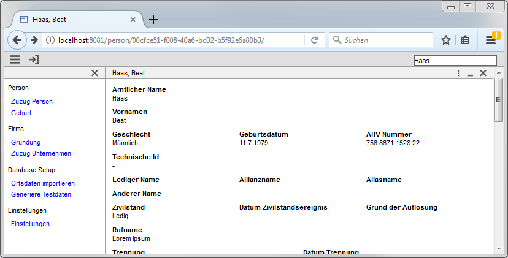

= Routing

The name routing is based on the routing concept of Angular. But only the name. While routing is a
central concept in Angular it's more of a nice to have in Minimal-J. You can build a complex application
without routing and you will miss nothing.

In web application routing means you can enter an URL and will be forwarded to certain page.
Or the application does change the URL itself and then changes the browser content accordingly.
In Minimal-J the application can show a page directly. A page can have a complex state and this
state could not be serialized in a readable String for the URL.

== Principle

In Application class the createRouting method can be overridden to enable routing.
The routing object  must be able to create route String for some pages and in reverse
parse a route and generate a Page of it.

Not all a pages must have a route. The pages displaying main entities are better candidates than detail
pages.

== Route Strings

The Route String of a page must fulfill certain rules:
 * no '/' at start or end
 * Only characters or digits or the four characters .-_/ are allowed
 * Before a '/' no '.' is allowed

This rules are validated with the Page.validateRoute method.
If a page creates an invalid route the route is ignored without warning.

These rules are a security measure because routes are used in the URL.

== Example
Here a an example of a Routing class

[source,java]
----
public class OpenEchRouting extends Routing {

	@Override
	protected Page createPage(String route) {
		String[] elements = route.split("/");
		if (elements.length >= 2) {
			switch (elements[0]) {
			case "person": return new PersonPage(elements[1]);
			}
		}
		return null;
	}

	@Override
	protected String getRoute(Page page) {
		if (page instanceof PersonPage) {
			return "person/" + ((PersonPage) page).getObjectId();
		}
		return null;
	}

}
----

When displaying a person you may notice the changing URL:

This URL can be bookmarked and directly accessed from the bookmark menu in the browser.