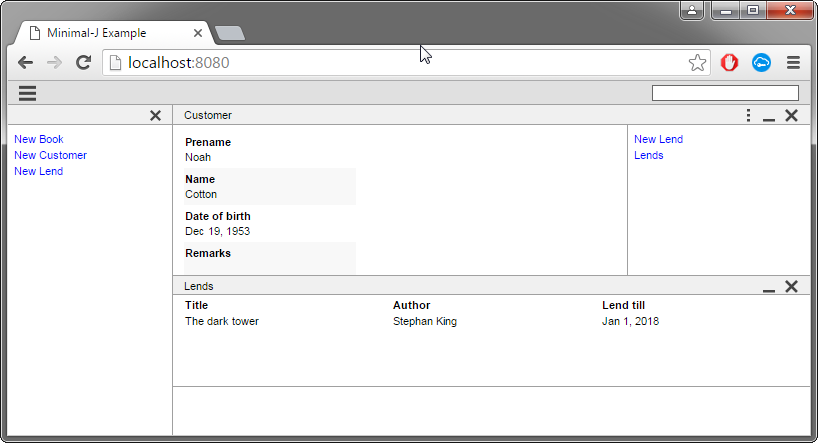
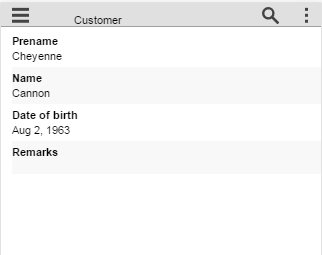

== Frontend details

As a beginner to Minimal-J you may just want to make things work. For that Minimal-J provides
some simple entry points:

* To *edit* an entity you have to extends the Editor class. Most of the time you can even
use the SimpleEditor oder the NewObjectEditor. The editor class extends from Action class. A
complete Editor class can be used in the getNavigation method in the Application class.

* To *display* a single entity there is an ObjectPage. You can use such a Page for example in the
method createDefaultPage of the Application class.

* To show a *table* of entities there are the classes TablePage, TablePageWithDetail, SimpleTablePageWithDetail,
SearchPage and SimpleSearchPage.

NOTE: 'Simple' in Minimal-j means that with these classes some first confusing stuff
can be left out. For example the SimpleEditor has only one generic parameters. A second
parameter is only needed if the save method returns a different class of objects as the
class of the edited object.

To learn Minimal-J it's a good idea to start with Editors and Pages. After some time
you will see that you need a little bit more. For example you need to create special FormElements.

Remember that some things are complicate in Minimal-J on purpose. These are the things
in my experience lead to problems. First you may think that Minimal-J is too strict. But
even with the small toolkit you can accomplish complete applications that look very clean
to your users!

== Key concepts

=== Pages

Pages are one of the building blocks of an application. On small device they fill up the whole
display space. On a large display a main page can be accompanied by some depending detail
pages.

Most frontends provide back and forward buttons to navigate between pages.

Pages provide a title, content and sometimes actions. The content should be static.
This means the user cannot make any input on a page. Inputs should be done in a dialog.

=== Contents

IContent is the interface used for contents of Pages or Dialogs.

[source,java,title="Page.java"]
----
public abstract class Page {
	
	public abstract IContent getContent();
	
	[..]
}
----

IContent is a marker interface with no methods at all. You normally don't implement your own
content classes but use one of the three possible contents for pages: tables (list of entities),
forms (details of an entity) or html (texts, reports).

Note that IContent doesn't extend IComponent. In contrast to other UI frameworks you cannot
nest components. It's not possible to put a table in a FormElement.

==== Table

Tables show a list of entities of the same class. Minimal-J doesn't support inheritance for business classes so the objects
will be really of the same class. Tables are meant to be read only. The displayed objects cannot be edited directly in the table.
But tables can have a context menu with actions. And a row of table can be double clicked (or 'started' in the way the frontend
should do it according where it lives).

Table columns have all the same width. If this hurts too much it is possible to merge to fields of the business object in one column.

===== TablePage

To display a table you can extend from TablePage. TablePage needs the keys for the columns.
The keys are the $ constants from the entity. And you have to implement the load() method to define what are the entities
the table should contain.

===== TablePageWithDetail

There is the common pattern that from a list of entities one is selected and from the one the details should be displayed.
This is sometimes called master/detail pattern.

[source,java,title="TablePageWithDetail.java"]
----
public abstract class TablePageWithDetail<T, DETAIL_PAGE extends Page> extends TablePage<T> {

	public TablePageWithDetail(Object[] keys) {
		super(keys);
	}

	protected abstract List<T> load();

	protected abstract DETAIL_PAGE createDetailPage(T mainObject);

	protected abstract DETAIL_PAGE updateDetailPage(DETAIL_PAGE page, T mainObject);
	
	[..]	
}
----

As this pattern can have different specialities there are some aspects to know about the TablePageWithDetail class.

Even if all the objects in the table must be of the same class the Pages used to display their details can vary.
The method createDetailPage() should construct a page that can be used to display the details of the object 'mainObject'.

Now if the user selects an other entity the method updateDetailPage() method. This method can decide if the already
existing page can be reused with new values or of a completly new Page should be constructed. In other words the
method can return the page it gets as input argument or go the more expensive way and throw away the existing page.

===== SimpleTablePageWithDetail

If TablePageWithDetail is too complicated for your needs maybe SimpleTablePageWithDetail is what fits. If it's for sure
that the same detail page can be used for every entity in the table then the updateDetailPage() method is not needed.
SimpleTablePageWithDetail provides a default implementation for that method.

==== Html

With html content you can break out from the constraints given by Minimal-J. A HtmlPage can display basically every URL or html
string. The frontends may depend on system functionality for that. For example the SwingFrontend uses the JavaFX bridge to the system
browser. And for the web based frontend displaying web content is the easiest part.

Displaying html is meant to be used for start or help pages. Also report engines (not in scope for Minimal-J) could present their
reports. Of course the html pages could contain links and even input forms. But this is _not_ the way to extend the functionality
of Minimal-J or to circumvent its rules.

==== Form

Forms in Minimal-J have basically the same function as in HTML.
You define with a Form what fields of an entity are shown and in which order.
Fields can depend on each other. This could mean if a checkbox is selected some fields get editable.

There are no things like 'LayoutManagers'. Of course the order in which you add the fields define somehow
the later layout of the form. But you cannot set horizontal weights to a field. This makes all forms look very regular.

==== FormElement

FormElement objects represent the _business_ side. Fields of an entity are 'bound' to a FormElement.
Minimal-J doesn't emphasize much on binding. There is no thing like BindingContext. Forms have their elements.
If an entity is set to the form by calling setObject then the fields from which the
elements were created are forwarded to the FormElements.

Note that a FormElement is _not_ a IComponent but _provides_ one. This
is necessary as the specific implementations of the components depend on the chosen Frontend.

The framework provides the basic form elements like the ones for formatted strings, dates, numbers and enumerations. But
for more complex types you will define your own FormElement classes. There are two base classes for that.

===== FormatFormElement

FormatFormElement ist the abstract base class for all temporal FormElements. But it is not limited to that.
FormatFormElements are visualized as text fields. But their input is an Object. You have to override these methods:

[source,java,title="FormatFormElement methods"]
----
	protected abstract String render(T value);
	protected abstract T parse(String text);
	protected abstract String getAllowedCharacters(PropertyInterface property);
	protected abstract int getAllowedSize(PropertyInterface property);
----

With 'render' you determin how a object should be rendered as text. The method 'parse' should be able
to take that output and revert it back to the original object. Of course you have to take care that these
two methods correspond well! The rest of the methods restrict the used text field. 'getAllowedCharacters'
may also return null.

link:https://github.com/BrunoEberhard/open-ech/blob/master/src/main/java/ch/openech/frontend/ech0011/ReligionFormElement.java[An example in open-ech]

===== FormLookupFormElement

When a entity is too complex it's not possible to render is as text. Or it is very hard to implement
parse in a correct way. FormLookupFormElement visualizes as a read only text field. The changes are made
in a separate form dialog which is opened when the user clicks a button on the right of the text field.
You can override these methods of FormLookupFormElement

[source,java,title="FormLookupFormElement methods"]
----
	protected String render(T value);
	protected abstract Form<T> createForm();
	protected Form<T> createObject();
----

'render' means the same as for FormatFormElement. Here the default behavior is to render with 
'Rendering.toString' but you can override this. The most important method is of course 'createForm' which
should provide a form to edit the entity.

link:https://github.com/BrunoEberhard/open-ech/blob/master/src/main/java/ch/openech/frontend/ech0011/MaritalDataFormElement.java[An example in open-ech]

===== LookupParser

Sometimes a form should be provided but still the text field should be editable. For example the user may enter
the values with the form dialog the first time. After he sees how the values can be entered in the text field
directly he will choose that possibility from now an.

FormLookupFormElement may implement the interface 'LookupParser' to allow that:

[source,java,title="LookupParser methods"]
----
	protected abstract T parse(String text);
	protected abstract String getAllowedCharacters();
	protected abstract int getAllowedSize();
----

As expected these methods are quite similar that the ones from FormatFormElement.

link:https://github.com/BrunoEberhard/open-ech/blob/master/src/main/java/ch/openech/frontend/ech0011/ReligionDataFormElement.java[An example in open-ech]

===== ListFormElement

If a entity field contains a list of (a few) depending entities you may use ListFormElement.
Depending entities don't have an id field of their own. They cannot be saved or loaded without the main entity.

[source,java,title="LookupParser methods"]
----
	protected abstract Form<T> createForm();
	protected CharSequence render(T item);
	protected List<Action> getActions(T entry);
	protected Action[] getActions();
----
You have to provide the form to edit an entity. You may also override the way the entities are rendered ('render')
which actions are provided for a specific entity 'getActions(T)' or which actions should be offered for
every entry (or even the empty entry if the list is empty).

link:https://github.com/BrunoEberhard/open-ech/blob/master/src/main/java/ch/openech/frontend/ech0011/PlaceOfOriginAddonFormElement.java[An example in open-ech]

===== ReferenceFormElement

ReferenceFormElement is used if a field contains an other identifiable entity. This means the user has to choose one in
a search Dialog. You have to specify the used columns in the search dialog.

===== SelectionFormElement

Sometimes the possible choice for a field depends on the content of an other field. With SelectionFormElement you can dynamically adapt the 
options provided to thes user. Normally the selection is provided by a getter method on the entity.

==== Form (as factory)

When you add some lines to a form by calling the line(Object) method the Form tries to automatically create
the matching FormElement for you. This happens in the methods createElement. The first one with
an Object as input tries to find out if you already provided a FormElement. You may want to do
this if in your case the automated creation of the FormElements doesn't work. For example
if you have a implemented specialization of a FormElement yourself.

[source,java,title="Form.java"]
----
	public FormElement<?> createElement(Object key) {
		[..]
		if (key instanceof FormElement) {
			element = (FormElement<?>) key;
			property = element.getProperty();
			[..]
		} else {
			property = Keys.getProperty(key);
			[..]
			element = createElement(property);
		}
		return element;
	}
----

If the key is no FormElement then the other createElement method is called.
In this method exists an if case for every field class known to the Minimal-J framework.

[source,java,title="Form.java"]
----
	protected FormElement<?> createElement(PropertyInterface property) {
		Class<?> fieldClass = property.getClazz();
		boolean editable = this.editable && !property.isFinal();

		if (fieldClass == String.class) {
			return editable ? new StringFormElement(property) : new TextFormElement(property);
		} else if (fieldClass == Boolean.class) {
			return new CheckBoxFormElement(property, editable);
		}	
		[..]
		logger.severe("No FormElement could be created..");
		return new TypeUnknownFormElement(property);
	}
----

It's a good idea to subclass Form and override the createElement(PropertyInterface) method. You can add your own
FormElement classes. Here the exmaple from the Open-eCH project:

[source,java,title="EchForm.java"]
----
	@Override
	public FormElement<?> createElement(PropertyInterface property) {
		Class<?> type = property.getClazz();
		if (type == DatePartiallyKnown.class) {
			return new DatePartiallyKnownFormElement(property, editable);
		} else if (type == PersonIdentification.class) {
			return new PersonIdentificationFormElement(property);
		} else if (type == PartnerIdentification.class) {
			return new PartnerIdentificationFormElement(property);
		} else if (type == Person.class) {
			return new PersonFormElement(property);
		[..]
		}
		return super.createElement(property);
	}		
----

===== Inputs / Components

Minimal-J doesn't try to have as many shiny components as possible. Where other frameworks are proud to present pages of predefined components
Minimal-J restricts you basically to texts, comboboxes and checkboxes (with some variations).

The Frontend class acts a factory for all components. This makes sense as for different frontends (web or rich client) different components have
to be created. Normally you don't create components in your Editors. You create a Form an fill it with
FormElements. The FormElements then create the components through the factory.

The interface for Input has only 3 methods.

[source,java,title="Input.java"]
----
	[..]
	public interface Input<T> extends IComponent {
		public void setValue(T value);
		public T getValue();
		public void setEditable(boolean editable);
	}
----

You can change the value of a Input component or you can get the value. And the only state that can be
changed after creation is if the Input is in a editable state. It's quite common to have some FormElements
disabled based on some input the user has given in a previous field.

For comboboxes or checkboxes there are no specific interfaces. All the additional information such an Input
needs is provided when the Input is created. Some of the factory methods:

[source,java,title="Frontend.java"]
----
	[..]
	public abstract Input<String> createTextField(int maxLength, String allowedCharacters, InputType inputType, Search<String> suggestionSearch, InputComponentListener changeListener);
	public abstract <T> Input<T> createComboBox(List<T> object, InputComponentListener changeListener);
	public abstract Input<Boolean> createCheckBox(InputComponentListener changeListener, String text);
----

So you can provide a max string length for a text the user may enter. Or restrict the allowed characters. With InputType you
can specify that the input must be for example a phone number (InputType of course comes from the HTML5 tag).
Remeber that normally you don't actually call these methods directly but through creating FormElements. There you have
to provide all these parameters. But that's only once.

The InputComponentListener parameter must be the listener that gets informed if the user enters some new value in the Input.
This listener must be provided and cannot be null. It would simply make no sense to have no listener. If the user
can enter some value someone should get informed. 
