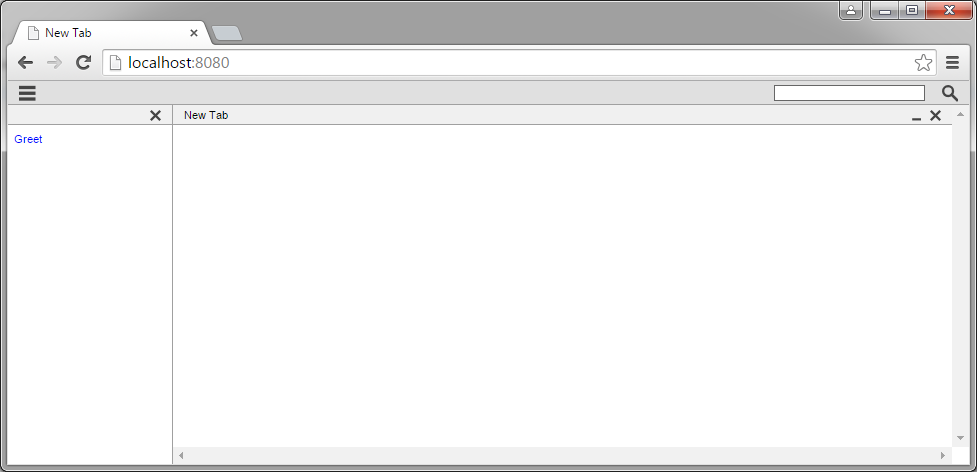
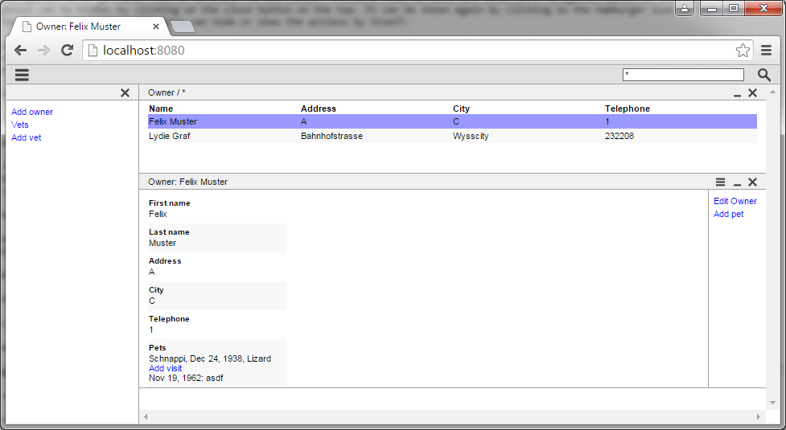
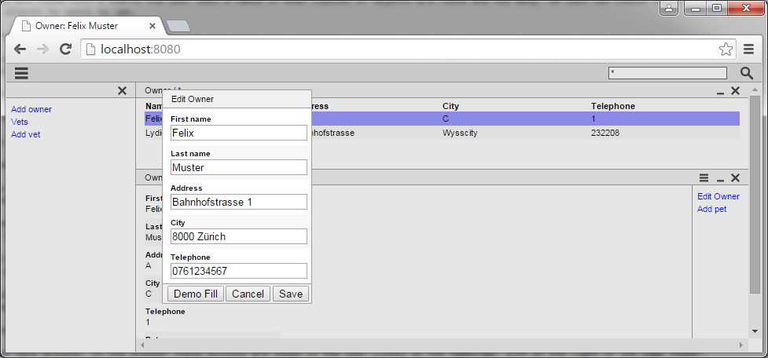
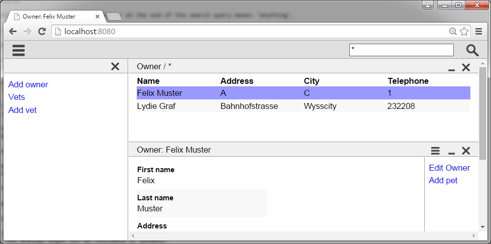

== User guide

This guide should show you how to use a Minimal-J application. It's also a good start point to see what can be done with Minimal-J (and what cannot be done).

=== At start

=== Main navigation

The main navigation is a (grouped) list of actions. In the browser frontend these actions are shown in a navigation panel on the left.
The navigation can be hidden by clicking on the close button on the top. It can be shown again by clicking on the hamburger icon in the
header. There is now ways the application can hide or show the actions by itself.

Navigation actions cannot disappear or be added once a user is logged in. The roles of the user determinate the list of actions. The
current content on the right *cannot* change the actions on the left. Only if a dialog is shown the navigation actions cannot be accessed.
At all other times the navtion actions are kind of 'start over' points for the user.

=== Search

The search field is in the header on the right. It can be accessed at all time except a dialog is open.

==== Results

Normally the search covers all classes of objects in the application for which the application has defined a search page. If two classes
of objects are found with a search the user sees a table of what classes of objects are found and how many. He then can choose which
class of objects he wants to see.

==== Filtered search

If the user wants only see objects of a specific class he can prefix the search query with something like 'Person:Meyer'. Then only
person objects are listed. If no other class of objects starts with 'P' then it's also possible to search for 'P:Meyer'.

==== Wildcards

By convention a * character at the start or at the end of the search query means 'anything'.

=== Pages and Details

Pages are the building blocks of an application. There are two typical classes of pages. Pages that show information about an busines
entity. And pages that list many of them. You never change an entity on a page. Only in dialogs a entity can be created or changed.

Some frontends may always display one page at a time. But the web frontend can show multiple pages. Each newly shown page is positioned
below of the existing ones.

Note that an application *cannot* force two pages to be shown. If a list of entites and its details should be shown the application has
first to present a list of the entites. Then on click (or selection) of an entry the detail might be shown.

If you close a page the page itself and all pages (details) below this page are closed. Not the user nor the application can reorder the pages.
But the application can close a detail (for example if a list entry has no detail informations).

=== Actions

A page can have actions. In the browser these actions are shown if the user clicks on the hamburger icon on the right of the page header.
Also a click with the right (second) mouse button activates (or deactivates) the action panel.

Some of these actions might be disabled because of the shown business entity. But they should not disappear.

=== Dialogs 

Actions (from navigation or a page) can open dialogs. Dialogs block all the pages and the navigation. Dialogs can be nested. In some
frontends the dialogs might not be resizable or movable.

Applications cannot set the size of dialogs directly. The only thing they can specify is a relative width of the form columns.

=== Zoom

The font size of the application can be changed with the normal browser zoom. The application cannot set the font sizes.

=== Language

Also the language can be changed by setting the prefered language in the browser settings.