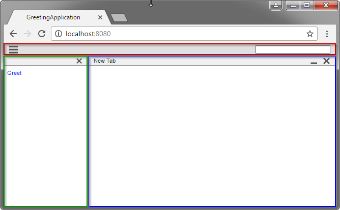
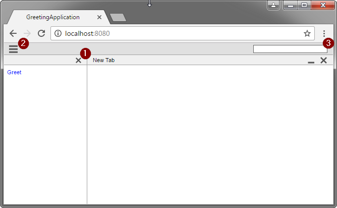
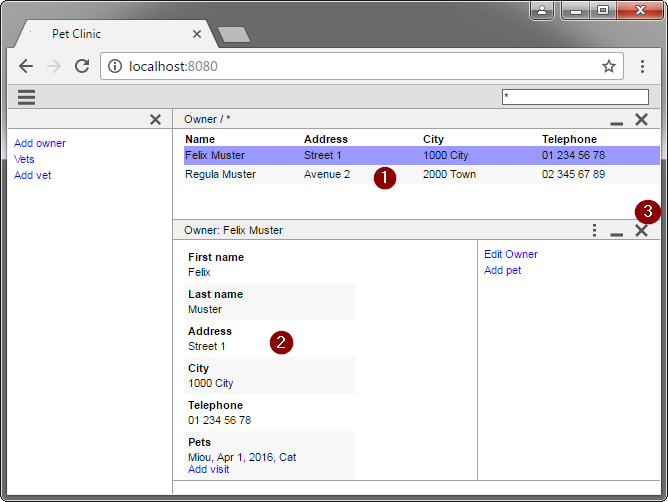
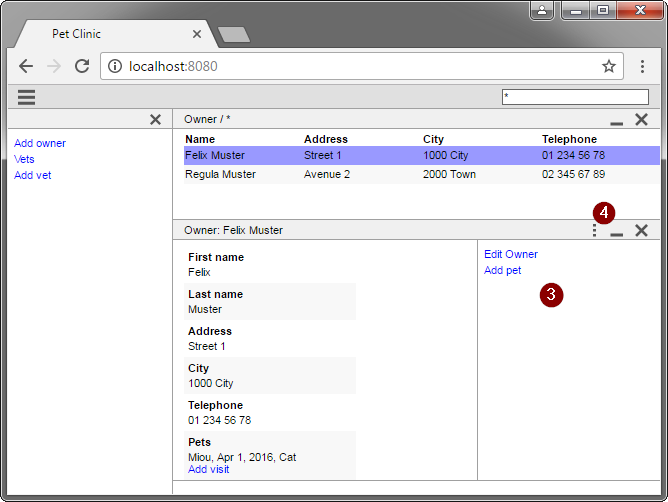
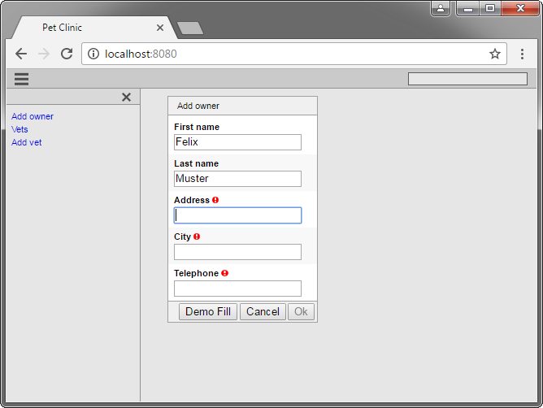
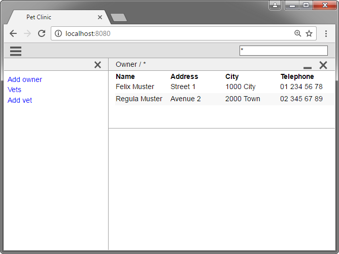

= User guide

This guide should show you how to use a Minimal-J application in a desktop browser. It's also a good start point to see what can be done with Minimal-J (and what cannot be done).

On a mobile device the application will look different.

== The main blocks

There can be different styles of frontends in Minimal-J. But the three main blocks can always be identified. In the image above the
blocks are marked. Red ist the header block. The content of the header can contain more or less elements. For example if the application
doesn't support authentication the login buttin is not displayed.

The green block is the main navigation. And in the blue block the actual data is displayed.

== Navigation

The main navigation is a list of actions. In the browser actions are presented as links in blue color.
If there are many actions the application can group them.
The navigation can be hidden by clicking on the close button on the top (1). It can be shown again by clicking on the hamburger icon in the
header (2). There is no way the application can hide or show the actions by itself.

Navigation actions cannot disappear or be added once a user is logged in. The roles of the user determinate the list of actions. The
current content on the right *cannot* change the actions on the left. Only if a dialog is shown the navigation actions cannot be accessed.
At all other times the navtion actions are kind of 'start over' points for the user.

=== Search

The search field is in the header on the right (3). It can be accessed at all time except a dialog is open. The search is performed
when the user hits the 'Enter'-key.

==== Results

Normally the search covers all classes of objects in the application for which the application has defined a search page. If two classes
of objects are found with a search the user sees a table of what classes of objects are found and how many. He then can choose which
class of objects he wants to see.

==== Filtered search

If the user wants only see objects of a specific class he can prefix the search query with something like 'Person:Meyer'. Then only
person objects are listed. If no other class of objects starts with 'P' then it's also possible to search for 'P:Meyer'.

==== Wildcards

By convention a * character at the start or at the end of the search query means 'anything'.

== Pages and Details

Pages are the building blocks of an application. There are two typical classes of pages. Pages can show a overview list of business entities (1).
Or the details for entity can be shown (2). By double clicking a entity in a list the details will be opened (if available). When the detail
is already open a selection change in the list will update the details.

You never change data of an entity on a page. Only in dialogs a entity can be created or changed. Also in a list of entities it's not
possible to change something.

As you see the web frontend can show multiple pages. Each newly shown page is positioned
below of the existing ones. Sometimes it's usefull to minimize the pages above. You can do this with the middle button in the page header. If you click
the close button in the page header (3) the page and all below of this page will be closed. As user you cannot change the order of
the pages. Nor can the application by itself.

Note that an application *cannot* force two pages to be shown. If a list of entites and its details should be shown the application has
first to present a list of the entites. Then on click (or selection) of an entry the detail might be shown.

=== Actions

A page can have actions. These actions are displayed on the right side of the page (3). They can be hidden (and shown again)
by clicking on the left button in the page header (4). Also a click with the right (or the second) mouse button shows or
hides the actions.

Some of these actions might be disabled because of the shown business entity. But they should not disappear.

=== Dialogs 

Actions (from navigation or a page) can open dialogs. Dialogs block all the pages and the navigation. Some dialogs can open
a (sub) dialogs. So dialogs can be nested.

The web frontend doesn't support resizing or moving of dialogs.

As long that there are validation errors a dialog cannot be closed with the 'Ok' button. The form fields causing the errors are marekd
with a red circle. Hovering the mouse over this red circle the problem is shown.

=== Zoom

The font size of the application can be changed with the normal browser zoom. The application itself cannot set the font sizes.

=== Language

Also the language can be changed by setting the prefered language in the browser settings.