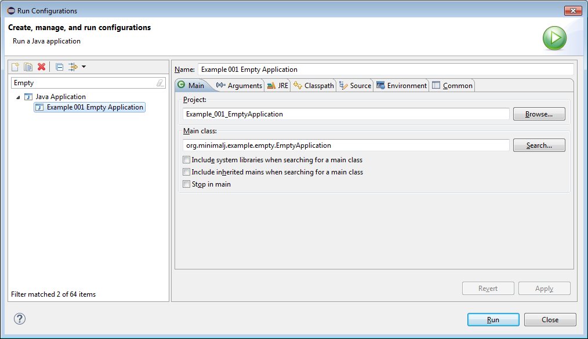

== Empty Application

The most minimal (meaning empty) minimal-j application:

[source,java,title="EmptyApplication.java"]
----
package org.minimalj.example.empty;

import org.minimalj.application.Application;

public class EmptyApplication extends Application {

}
----

As you might have guessed this application does nothing at all. To run it you need the jar of minimal-j.

=== Result

=== Eclipse configuration

The run configuration in eclipse:

The classpath must contain at least the minimal-j.jar. Later you need a jdbc driver in the classpath and possibly a UI library but right now
the minimal-j.jar is enough.

=== Maven pom.xml

Of course you can setup your project with maven. Here the pom.xml. Remember: later you need also a jdbc driver.

[source,xml,title="pom.xml"]
----
<project xmlns="http://maven.apache.org/POM/4.0.0" xmlns:xsi="http://www.w3.org/2001/XMLSchema-instance"
	xsi:schemaLocation="http://maven.apache.org/POM/4.0.0 http://maven.apache.org/xsd/maven-4.0.0.xsd">
	<modelVersion>4.0.0</modelVersion>
	<groupId>org.minimalj.example</groupId>
	<artifactId>emptyApplication</artifactId>
	<version>1.0</version>
	<name>Example_001_EmptyApplication</name>
	<description>The empty application shows how to set up a Minimal-J application</description>
	<build>
		<plugins>
			<plugin>
				<artifactId>maven-compiler-plugin</artifactId>
				<version>3.0</version>
				<configuration>
					<source>1.8</source>
					<target>1.8</target>
				</configuration>
			</plugin>
		</plugins>
		<sourceDirectory>src</sourceDirectory>
	</build>
	<dependencies>
		<dependency>
			<groupId>org.minimalj</groupId>
			<artifactId>minimalj</artifactId>
			<version>0.4.0.0-SNAPSHOT</version>
		</dependency>
	</dependencies>
</project>
----
