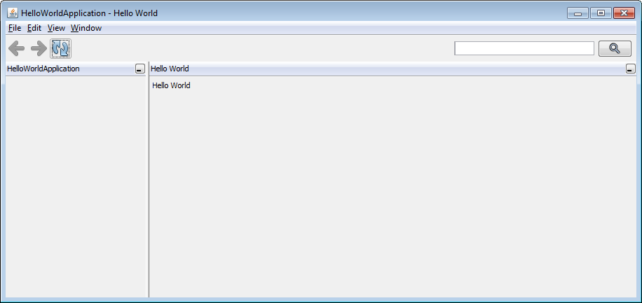
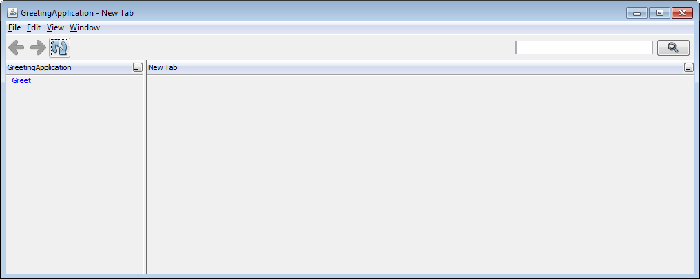

== Hello World

The second application says 'Hello World'. In the application class it can be defined what is the
default page when starting the application:

[source,java,title="HelloWorldApplication.java"]
----
package org.minimalj.example.helloworld;

import org.minimalj.application.Application;
import org.minimalj.frontend.page.Page;

public class HelloWorldApplication extends Application {

	@Override
	public Page createDefaultPage() {
		return new HelloWorldPage();
	}

}
----

[source,java,title="HelloWorldPage.java"]
----
package org.minimalj.example.helloworld;

import org.minimalj.frontend.Frontend;
import org.minimalj.frontend.Frontend.FormContent;
import org.minimalj.frontend.Frontend.IContent;
import org.minimalj.frontend.page.Page;

public class HelloWorldPage extends Page {

	@Override
	public String getTitle() {
		return "Hello World";
	}

	@Override
	public IContent getContent() {
		FormContent form = Frontend.getInstance().createFormContent(1, 100);
		form.add(Frontend.getInstance().createLabel("Hello World"));
		return form;
	}

}
----

The page defines its title and its content. Later a page can also define its actions.

There are only two classes of IContent: Forms and Tables. A Label is not a IContent but a IComponent. 
That is the reason why the 'Hello World' Label must be put in a form and cannot be
returned as result for the getContent method.

Note that the getContent method does construct the return value but doesn't save it for
later calls of getContent. It can be expected that getContent is only called once.
You should not create the content in the constructor and return the reference in getContent.
Pages are meant to be light weight. So it's not recommanded to prepare all the content before
it is requested by a call of getContent.

The two arguments in createFormContent specifiy the number of columns (1) and the width of a
column. 100 means 'just a normal size'.

=== Result

== Greeting

Maybe you would like to be called by name from the appliction. For that of course you have to
enter your name first. A Minimal-J application always starts in the same way. You cannot skip the
main window at startup and only display a dialog (well of course you can by working around
the framework but please spare that for later). The user has to trigger an action to see
a dialog. The application class:

[source,java,title="GreetingApplication.java"]
----
package org.minimalj.example.helloworld2;

import java.util.Collections;
import java.util.List;

import org.minimalj.application.Application;
import org.minimalj.frontend.action.Action;

public class GreetingApplication extends Application {

	@Override
	public List<Action> getMenu() {
		return Collections.singletonList(new UserNameEditor());
	}
	
}
----

Now only the getMenu method is defined. getMenu can return a tree structure of actions. The actions
are listed in the left part of the main window (most frontends will do this but the frontends
are free to display the menu elsewhere or not at all).

To group the actions you can use the ActionGroup class. But in this application we have only one
action. Its definition is:

[source,java,title="UserNameEditor.java"]
----
package org.minimalj.example.helloworld2;

import org.minimalj.frontend.Frontend;
import org.minimalj.frontend.editor.Editor.UserNameEditor;
import org.minimalj.frontend.form.Form;

public class UserNameEditor extends SimpleEditor<User> {

	public UserNameEditor() {
		super("Greet");
	}

	@Override
	protected User createObject() {
		return new User();
	}
	
	@Override
	protected Form<User> createForm() {
		Form<User> form = new Form<>();
		form.line(User.$.name);
		return form;
	}

	@Override
	protected User save(User user) {
		return user;
	}
	
	@Override
	protected void finished(User user) {
		Frontend.getBrowser().show(new GreetingPage(user));
	}

}
----

Minimal-J doesn't provide a dialog with a String return. In real life application tend to do
more than a hello world and most of the forms contain data of a business object. Thats why
we need a full blown Editor to only enter a name. On the other side it's easy to understand what
the class does. 

In the constructor a super constructor is called with the name of the Editor. Every Editor extends
from Action. The name of the Editor is therefore displayed as item in the menu. Later you see
how to use ResourceBundles but right new pass simply the String to display.

The createObject method should of course create an Object ready to be edited. It's somehow the
source for the editor. We come back to that.

The createForm builds the form (mask) of the editor. This is done programmatically and not as
declaration (xml-file). Why? Because in more complex applications you will run into situations
where you want to leave some fields out. For example if the current user doesn't have the
permission to see some parts. Or you want to reuse a form for different use cases. Most parts of
the forms for this use cases are the same - but only most. Again you are very happy to be
able to only 'if' some lines out. Forms are an important part of every Minimal-J application.
We see later more of them.

The form constructed her has only one field. Which field is defined with the line - method.
The fancy $ is explained below. 

The end of the editor are the save and the finish method. Save is called 
when the user has decided to to finish the editing (in most frontends this means he has clicked a
save button or pressed the enter key in a text field).

Our save method doesn't really persist anything. We simply pretend everything is done and
return the user back to the framework.

If the save method is successful (without exception) the finished method is called. If
the frontend shows editors in a dialog this dialog is already closed at this moment. This is
one difference between save and finished. The other is that the save method should perform
the time consuming stuff like calling a server or do a transaction with the db (you see later
how to do this).

The finished method can do some aftermath of the editor. If the user entered a complex
business object in an editor he might like to see the result when the editor dialog closes. If
not he might doubt if the save has been successfull or if even think the whole work on the
object is lost.

Our finished method decides to show the expected greeting page.

=== Details

==== Magic object creation

You have probably see the comment above createObject. Please try to do what it says. Remove
the method and start the application again. Everything still works. Why? Because the super
class NewObjectEditor implements some magic:

[source,java,title="Magic of NewObjectEditor"]
----
	@Override
	protected T createObject()  {
		@SuppressWarnings("unchecked")
		Class<T> clazz = (Class<T>) GenericUtils.getGenericClass(NewObjectEditor.this.getClass());
		T newInstance = CloneHelper.newInstance(clazz);
		return newInstance;
	}
----

The NewObjectEditor tries to guess the class that should be edited. This by reading the
type (generic parameter) of the editor class.

But what about erasure? Aren't generics not removed at compilation time? Not all of them. A class
with generics keeps the information even at runtime. Minimal-J uses this trick at some places.
Unfortunately use of types cannot be declared mandatory. If you use NewObjectEditor without
type parameter _and_ remove the createObject the default createObject will throw an exception!

==== The edited entity

[source,java,title="User.java"]
----
package org.minimalj.example.helloworld2;

import org.minimalj.model.Keys;
import org.minimalj.model.annotation.Required;
import org.minimalj.model.annotation.Size;

public class User {
	public static final User $ = Keys.of(User.class);
	
	@Required @Size(255)
	public String name;
}
----

Here the user is defined as to have a name. The name is even required as annotated. This annotation
is used in the editor dialog (you cannot finish the dialog without something in the name field) and
also later if a attribute is persisted in a database.

The second annotation defines the maximum size of the name. You could think today a framework should
not need to have maximum sizes of a string (in the UI large texts can be scrolled, text files or database
space are quite unlimited). Still almost all real applications use limited string fields. As xml
schemas or as columns in a database. Even if your application could handle unlimited Strings at the
interfaces to other applications you are quite sure be forced to handle some limits.

This is the reason why Minimal-J enforces the size annotation for every String attribute.

=== The fancy $

Now what about this fancy $ constant? This is a trick to use the class attribute definitions also
to use as constants to construct the forms. It's also used for some db stuff for example queries.
This trick is needed as even in java 8 you don't have a construct like class::attribute. This
is a pitty as there is now a construct like class::getAttribute(). Do you now what this does?
It doesn't call the getAttribute method it references it. JavaScript like, isn't it?
So class::attribute would be the value of this attribute but a reference to the specific field in
the class. But as I said this doesn't exist yet so the fancy $ is still needed.

WARNING: Do *never* change the content of the $ object. Not even temporary. You'll see other possibilities
to change the created form fields.

//// move this to the $ section

Note2: The $ trick works quite well. There is only one point where it gets ugly: enum. Don't be
afraid the framework does everything for you. The problem is that the framework needs to be able
to differentiate between to attributes of the same enum class. For this a arbitrary (?willkürlich) number of
enum elements must be created at runtime. This is done in the EnumUtils class. This class works
with java 8 and android but later jdk implementations could break the implementation.
