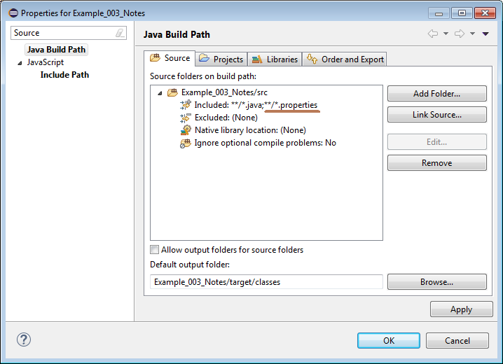

== Notes

This example shows some kind of persistence and a table page. There are only a few Page classes. The
first you have seen is the one which contains a read only form. Editable forms are shown in dialogs although
a frontend can decide to show a Dialog the same ways as a Page.

The table Page needs to specify its columns and how the data in the table is loaded.

[source,java,title="NoteTablePage.java"]
----
package org.minimalj.example.notes;

import java.util.List;

import org.minimalj.backend.Backend;
import org.minimalj.frontend.page.TablePage;
import org.minimalj.transaction.predicate.By;

public class NoteTablePage extends TablePage<Note> {

	private static final Object[] columns = new Object[]{Note.$.date, Note.$.text};
	
	public NoteTablePage() {
		super(columns);
	}

	@Override
	protected List<Note> load() {
		return Backend.persistence().read(Note.class, By.all(), Integer.MAX_VALUE);
	}
}
----

For the column definition again the $ syntax is used. The frontends must take care of the correct
rendering of the supported attribute classes. You don't need / cannot specify the used date format.
The frontend could even delegate the choice for the date format to the user.

Also you cannot change the widths of the columns. The user can the implementor not! Later we see
how you can concat two attributes in the table. With that pattern you can avoid that two small
columns need a lot of space in a croweded table.

I think you unterstand what the load method wants to do / say. But what must be done to make this
work? If nothing else is specified at startup of an application a apache derby database is used
for persistence. This is a database included in every JDK (but not in the JRE. You have to include
it in the classpath yourself!). Without configuration the database lives only in the JVM memory.
All data will be lost when the application exits.

There is always something to configure as soon as a database is involved in an application:
The type of database, the location, the connection parameters. All this can be called a
DataSource - thats the name of the JDK class.  For the moment we can ommit these start parameters.
The default is what we want: A temporary database in the memory is used and all needed tables in
the schema are created at startup.

[source,java,title="NotesApplication.java"]
----
package org.minimalj.example.notes;

import [..]

public class NotesApplication extends Application {

	@Override
	public List<Action> getMenu() {
		ActionGroup menu = new ActionGroup(null);
		menu.add(new NewNoteEditor());
		return menu.getItems();
	}

	@Override
	public Page createDefaultPage() {
		return new NoteTablePage();
	}

	@Override
	public Class<?>[] getEntityClasses() {
		return new Class[]{Note.class};
	}

}
----

In the application it the entity classes must be specified. Only the main entities in fact. If an
entity has depending entities these must not be listed. They will be found by the persistence framework.

Now for the entity:

[source,java,title="Note.java"]
----
package org.minimalj.example.notes;

import [..]

public class Note {
	public static final Note $ = Keys.of(Note.class);
	
	public Object id;
	
	public LocalDate date;
	
	@Size(2000) @Searched
	public String text;
}
----

Entities meant to be persisted have one thing to fullfil: They must have an id attribute of class Object
(later codes relax this condition, they can use String or Integer as id. But only codes can do this).

For most of the persistence framework it would have been possible to work without the id. But the
burden to have an id attribute didn't justify all the needed tricks in the framework. And sometimes
it's quite handy to be able to access the id of an object.

CAUTION: If you access the id attribute don't cast it in a specific class. Even if you find out the
specific class with a debugger. It's the frameworks domain to change the class of the id object.
Only use the id object to pass it around or compare it with equals to an other.

=== Database in a file

You may find it not practical that at every startup the database is empty again. What sense make such a
database (except for test classes)? For derby db you can specify a file in which all data is stored. This is implemented by 
derby db, its not a feature of Minimal-J. You can configure the file VM parameter MjBackendDatabaseFile.

The benefit of this configuration is quite limited. In development it may be helpful to reuse entered
data after some change in the code. But note: The derby db file is not meant to be access by two JVM
at the same time. Derby db forbids this. So you have to stop every other instanceof of an application
before try to start a new one.

And for real life configurations you will use heavier kind of stuff. You will have have a single backend
with its database. Every frontend will connect to this backend for example with a socket connection.

=== The 'ORM'

But hey - what SQL magic goes on in the backend when inserting and loading entities? You may see it by
configuring the logging.

[source,title="logging.properties"]
handlers = java.util.logging.ConsoleHandler
java.util.logging.ConsoleHandler.level = FINEST
SQL.level = FINEST

Java must know about this file. You have to add a VM property
[source,title="logging.properties"]
-Djava.util.logging.config.file=logging.properties

=== The resource bundle

in the previous examples some labels were marked with ' signs. This meant that the resource texts for those
labels were missing. For this example there is a property file with the needed texts. Minimal-J uses the
resource bundles included in the jdk. For an introduction see https://docs.oracle.com/javase/tutorial/i18n/resbundle/propfile.html .

[source,title="NotesApplication.properties"]
----
Note.text=Note
Note.date=Date

NewNoteEditor=New note

NoteTablePage=Notes
----

Minimal-J looks for a property file with the same name as the application on the same place. If you put
the property file in the java source folder make sure that it is copied from there when building.

Of course you can put the property file in a seperate resource folder. I don't always see why it's a good idea to have
it so far away from the rest but most projects are configured that way. Maybe if the application works in more
than one language.

To have a resource bundle with different name you can override the method getResourceBundle() in your Application. If you
have multiple files you should have a look at the class MultiResourceBundle which can combine two or more bundles in one.