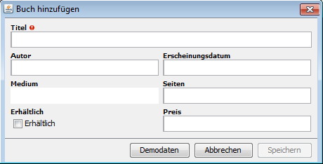

== Library

The model classes are quite restricted. They cannot have all kinds of classes for their
attributes. But a few more than we have seen so far are possible. The book class in this
example shows most of the available attribute classes.

[source,java,title="Book.java"]
----
package org.minimalj.example.library.model;

import [..]

public class Book implements Rendering, Mocking {
	public static final Book $ = Keys.of(Book.class);

	public Object id;
	
	@Required @Size(ExampleFormats.NAME) @Searched
	public String title;

	@Size(ExampleFormats.NAME) @Searched
	public String author;

	public LocalDate date;
	@Size(4)
	public Integer pages;
	public Boolean available;
	public final Set<Media> media = new HashSet<>();
	@Size(6) @Decimal(2)
	public BigDecimal price;
	
	@Override
	public void mock() {
		title = "The dark tower";
		author = "Stephan King";
		available = true;
		date = LocalDate.of(2009, 1, 1);
		pages = 800;
		price = new BigDecimal(3990).divide(new BigDecimal(100));
	}

	@Override
	public String render(RenderType renderType, Locale locale) {
		return author + ": " + title;
	}
}
----

As always a model class defines the $ constant so that the class can be used later for forms and
tables. And as always there is the id attribute which must be of class Object. Normally you will
write these to things at the beginning of a model class. But the order of the attributes of a
class doesn't really matter. It would have been nice if it would matter because then it would
have been possible to build forms just by convention out of that order. But the java definition states that
the attribute order could be lost during compilation. All modern JDK keep the order but it would
have been too much magic to rely on that.

Of course a book has a title and an author. Both attributes are required. The definition of the
size is delegate to some constant in a Format - class. This is always a better idea than spreading
a lot of size numbers across the model.

Then a bunch of attributes follows to pretty much demonstrate all the available base classes
that can be used in models. I say base classes because no primitve types can be used!

IMPORTANT: The allowed base attribute classes are: String, Integer, Long, Boolean, BigDecimal,
LocalDate, LocalTime, LocalDateTime. The primitives int, long, boolean are not allowed in
model classes and will always cause the model classes to fail to 'model-check'.

It may seem harsh to reduce the allowed types in such way. On the other side it makes the
database mapping much more readable. And the JavaScript guys can live even with more restrictions
they only have String and double!

IMPORTANT: String, Integer, Long and BigDecimal must have a size annotation.

=== Set of enum

A special attribute is the media attribute. It is a Set of an enum class. This is some syntactical
sugar around a bit set. As the set in translated to an Integer before persisting the used enum
must have not more than 32 elements.

IMPORTANT: A bit Set must be declared final and be initialized.

=== Mocks

If you set the VM attribute MjDevMode=true the dialog to enter a book looks like this:

Do you see the third button in the button row on the left. With this button the form is filled
with valid demo data. This can be very useful if you have to retest a dialog a lot. It can also
be used for JUnit-tests.

The only method of the mocking interface is 'mock'. By convention after calling this method
the object should pass a validation.

NOTE: It's a good idea to fill one of the attributes with (exactly) 'Lorem ipsum'. Everybody
will know that this is only demo data when a object contains this text.

=== References

So far so good for the easy stuff of 'ORM'. Now for the 'R'-rated things, the relations or references.

[source,java,title="Lend.java"]
----
package org.minimalj.example.library.model;

import [..]

public class Lend {
	public static final Lend $ = Keys.of(Lend.class);
	
	public Object id;
	
	@Reference
	public Book book;

	@Reference
	public Customer customer;
	
	public LocalDate till;
}
----

A Lend object references a book and a customer. And it _only references_ them. It doesn't
_contain_ them. If you insert or update a Lend with a backend it is only saved which book or
customer you reference. The attributes of the book and customer are ignored (except of course
the id).

IMPORTANT: A model class with an id (a main entity) cannot contain another class with
an id attribute.

With this principle (and one more of the same type) it is ensured that every database action
is execute in reasonable time.

 