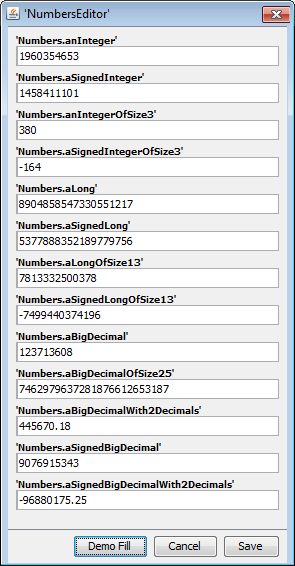

== Numbers

I have to say I couldn't think of a practial example to show all possible types of numbers.
The model class below simply lists most of the combinations for number fields.

[source,java,title="Numbers.java"]
----
package org.minimalj.example.numbers;

import [..]

public class Numbers {
	public static final Numbers $ = Keys.of(Numbers.class);
	
	public Integer anInteger;
	
	@Signed
	public Integer aSignedInteger;

	@Size(3)
	public Integer anIntegerOfSize3;
	
	@Size(3) @Signed
	public Integer aSignedIntegerOfSize3;

	
	public Long aLong;
	
	@Signed
	public Long aSignedLong;

	@Size(13)
	public Long aLongOfSize13;
	
	@Size(13) @Signed
	public Long aSignedLongOfSize13;

	public BigDecimal aBigDecimal;

	@Size(25)
	public BigDecimal aBigDecimalOfSize25;
	
	@Decimal(2)
	public BigDecimal aBigDecimalWith2Decimals;
	
	@Signed
	public BigDecimal aSignedBigDecimal;

	@Signed @Decimal(2)
	public BigDecimal aSignedBigDecimalWith2Decimals;
}
----

=== Annotations

Let's go through this entity. As mentioned the possible classes for numbers are Integer, Long and
BigDecimal. All of them can be signed or unsigned.

IMPORTANT: Without a signed annotation a number field is unsigned. But the range of unsigned Integer and Long
is _not_ extended. The range of the field 'anInteger' is 0 to 2147483647.

String fields must always have a Size annotation. For number fields it's optional. Be aware that
it is quite helpful for the user to have a specified size for numbers. The input form elements are
limited to the annotated size. The user cannot enter invalid values. Only if the size is 10 
the user could type the invalid values 2147483648 to 9999999999. In this case the form element is
marked as invalid.

The default size of BigDecimal fiels is 10. This is the default size used in MySql / Maria DB.
If nothing is specified BigDecimal fields don't have decimals. They act as if they are BigInteger.
Maybe BigInteger would have better performance but I rarely have seen them used. This is why
Minimal-J doesn't support BigInteger.

For specifiy an amount of money you probably want to have decimals. You specify this with the
Decimal annotation as seen in the Numbers class.

=== Mocks

All the form elements used to display and edit numbers support the 'Mocking' interface.
Remember to set the VM attribute MjDevMode=true to see the auto fill button below the form:

=== Properties

In the NumbersForm some trick is used to display all fields of the Numbers entity as form elements.

[source,java,title="NumbersForm.java"]
----
package org.minimalj.example.numbers;

import [..]

public class NumbersForm extends Form<Numbers> {

	public NumbersForm() {
		for (PropertyInterface property : Properties.getProperties(Numbers.class).values()) {
			Object key = property.getValue(Numbers.$);
			line(key);
		}
	}
}
----

The Properties class can be used to get one or all Property Interfaces of an entity class.
The static method getProperties returns a Map<String, PropertyInterface>. The keys of the Map are
the names of the fields. The values are the Property interfaces.

We iterate through all property interfaces. And with them we get the values from the $ object and
use the to fill the form with the line method.

NOTE: The getProperties method returns a LinkedHashMap. This means the Map is ordered and the iteration over
the values should return the elements always in the same order. There is a small catch in this.
Java itself doesn't guarantee to preserve the order of fields when compiling a class. For all the
existing JDKs the order isn't changed but it could be done in the future. You should not use this trick
with the getProperties for real world applications.
