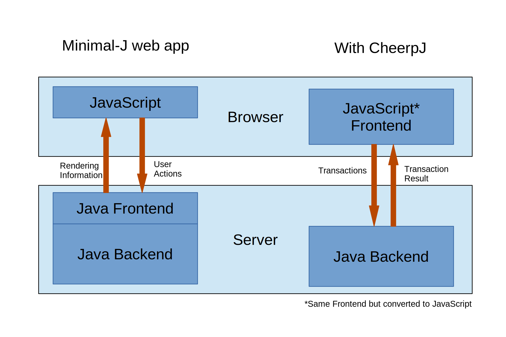

= Minimal-J with CheerpJ

With link:https://www.leaningtech.com/cheerpj/[CheerpJ] compiled Java classes can be converted to JavaScript files. And this actually works nearly 100%. The result can be used in every browser that supports JavaScript. Of course this is not the fastest thing to do but Minimal-J is small enough to be usable in most cases.

The normal html frontend is only a small JavaScript that renders the pages sent from the Java server and sends back every input action from the user. Every validation for example has to be done on the server and the result is sent back to the browser.
With CheerpJ the validations can be done in the browser without contacting the server at all. This saves a lot of roundtrips and may reduce the network traffic and the work load on the server. Today with cloud services counting every bit and cpu cycle that could save quite some money.
So the frontend is deployed completely in the browser. Only transactions are sent from the browser to the backend on the server. Somehow the same architecture as when you used a Swing client.

