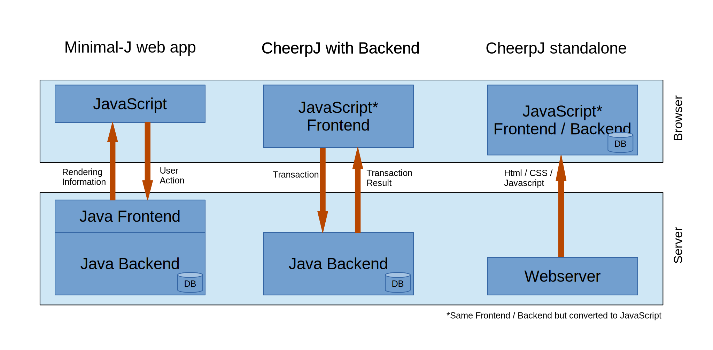

= Minimal-J with CheerpJ

With link:https://www.leaningtech.com/cheerpj/[CheerpJ] compiled Java classes can be converted to JavaScript files. And this actually works nearly 100%. The result can be used in every browser that supports JavaScript. Of course this is not the fastest thing to do but Minimal-J is small enough to be usable in most cases.

The normal html frontend (left diagram) is only a small JavaScript that renders the pages sent from the Java server and sends back every input action from the user. Every validation for example has to be done on the server and the result is sent back to the browser.
With CheerpJ the validations can be done in the browser without contacting the server at all. This saves a lot of roundtrips and may reduce the network traffic and the work load on the server. Today with cloud services counting every bit and cpu cycle that could save quite some money.

There are two ways to deploy a Minimal-J application with CheerpJ. Normally there still will be a Backend on a server. The repository and its Database is in that Backend. Now
only transactions are sent from the browser to the backend on the server. Somehow the same architecture as when you used a Swing client that connects to a Backend.

In the second configuration there is no more Java Backend. Only a web server that delivers the resources for the browser. The repository is implemented with a in-memory database.
Of course in this configuration every time the user refreshes the page all data is lost. So this configuration is only usable for demos.

Have a look a the link:http://www.openech.ch/minimalj_cheerpj_petclinic[Petclinic] deployed in the standalone configuration!

