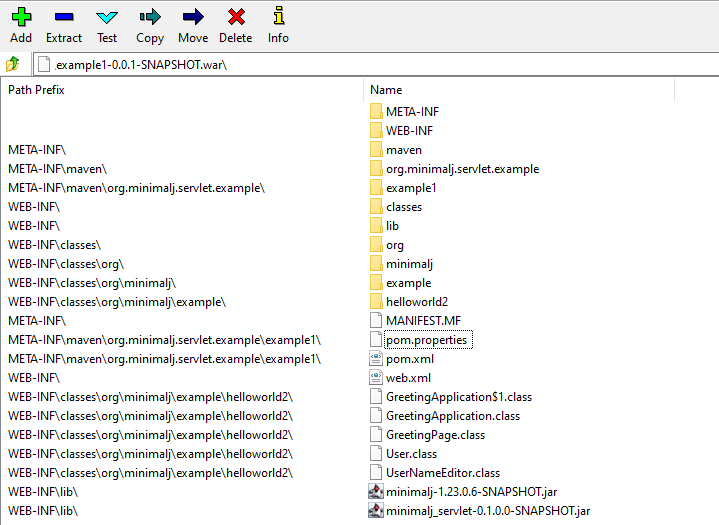

= Minimal-J as Servlet

With this extension Minimal-J can be deployed to a web container like tomcat.
This works only with the Minimal-J own web Frontend.

== How to

Deploy a web application is as easy as coping a war package and then spending an hour
to find out why it doesn't work. There are two major points to get wrong:

* The url of the application is not what you expect.
* The classes or libraries are not where the web container wants to have them.

=== Content of war file

The directory structure of deployed war file has to be something like this:

=== Directories in war file

* WEB-INF: contains web.xml (if needed)
* WEB-INF\lib: contains libraries as jar files
* WEB-INF\classes: contains class files
* META-INF: contains manifest and maven stuff. Not really needed